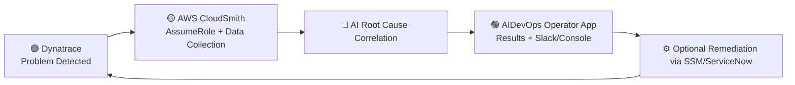

# 🧱 AWS CloudSmith + Dynatrace + AIDevOps — Architecture & Data Flow

---

## 1. 🧩 Architecture Components

### 🟣 Dynatrace (Observability & Detection)
- **Role:** Observability platform that monitors applications, Lambdas, and AWS services.  
- **Core AI:** Davis® AI detects anomalies and identifies where problems start.  
- **Data Sent:** Structured problem payloads (service name, timestamps, entity IDs, error codes).  
- **Purpose:** Acts as the *entry point* — detecting anomalies and initiating problem events.

---

### 🟡 AWS CloudSmith (AI Investigator)
- **Role:** AWS-side AI system that analyzes the root cause behind Dynatrace problems.  
- **Functionality:** Reads AWS configurations, CloudTrail logs, IAM policies, and deployment data.  
- **Mechanism:** Assumes the IAM AgentSpace role in your account via `sts:AssumeRole`.  
- **Goal:** Explains *why* the issue happened within AWS.

---

### 🟢 AIDevOps Operator App (Interface & Automation)
- **Role:** The console and Slack-based interface for users to interact with investigations.  
- **Functionality:** Displays results, suggests remediations, and can trigger workflows (SSM, ServiceNow).  
- **Value:** Bridges AI analysis and human response; integrates with incident channels.

---

### 🔐 IAM Role / AgentSpace Role (The Access Keyhole)
- **Role:** The IAM role assumed by the CloudSmith backend for read-only visibility.  
- **Policy:** `AIOpsAssistantPolicy` — broad `Describe*`, `List*`, and `Get*` access across 270+ services.  
- **Trust:** Limited to AWS CloudSmith service principal (`preprod.cloudsmith.amazonaws.com`).  
- **Purpose:** Allows CloudSmith to see configurations, relationships, and logs without altering resources.

---

### 📊 AWS Telemetry Sources (The Evidence)
CloudSmith gathers observability data from AWS-native systems:

| Source | Purpose |
|---------|----------|
| **CloudTrail** | Change tracking — who changed what and when. |
| **AWS Config** | Resource configuration snapshots. |
| **CloudWatch Metrics/Logs** | Health and performance telemetry. |
| **CloudFormation / CodePipeline** | Deployment activities and change events. |
| **IAM** | Permission sets, policies, and trust relationships. |
| **Service Configs (Lambda, S3, API Gateway, etc.)** | Operational context for affected entities. |

---

### 🔗 Dynatrace OpenPipeline (Optional)
- **Role:** Ingests enriched problem data back into Dynatrace after CloudSmith’s analysis.  
- **Outcome:** Dynatrace Problem cards display “Root Cause: IAM permission removed” annotations.

---

## 2. 🔁 End-to-End Data Flow

### 🟣 Step 1 — Detection
- Lambda or application fails (e.g., `AccessDenied`).  
- Dynatrace detects anomaly → triggers **Problem** event.

**Data:** Metrics, traces, and topology → Dynatrace

---

### 🟣 Step 2 — Problem Creation
- Davis AI identifies impacted service and dependencies.  
- Dynatrace sends structured Problem payload to CloudSmith.

**Data:** Dynatrace → CloudSmith (problem context)

---

### 🟣 Step 3 — Role Assumption
- CloudSmith invokes `sts:AssumeRole` into customer AWS account.  
- Gains short-lived credentials with read-only permissions.

**Data:** CloudSmith → AWS STS → Temporary Credentials

---

### 🟣 Step 4 — Evidence Gathering
CloudSmith queries multiple AWS services using the IAM policy:
- IAM: `GetRole`, `GetPolicyVersion`
- CloudTrail: `LookupEvents`
- CloudFormation: `DescribeStackEvents`
- CloudWatch: `GetMetricData`
- Service Configs: Lambda, S3, API Gateway

**Data:** AWS → CloudSmith (configs, events, metrics)

---

### 🟣 Step 5 — Correlation & Root-Cause Analysis
CloudSmith’s AI engine aligns timestamps and dependencies:
- “Was there an IAM change near the failure time?”  
- “Was a deployment or config drift detected?”  
- “Which AWS entity matches the Dynatrace failure?”

Outputs an analytical narrative, e.g.:
> “Lambda `ingestion-demo` failed because IAM role `lambda-exec-r1` lost `s3:PutObject` at 14:02 UTC.”

---

### 🟣 Step 6 — Result Presentation
- AIDevOps Operator App displays the findings.  
- Slack notification or console card summarizes the RCA and suggestions.  
- User can trigger remediation or ticket creation.

**Data:** CloudSmith → AIDevOps (root cause insights)

---

### 🟣 Step 7 — Optional Remediation
- AIDevOps can invoke AWS SSM Automation or ServiceNow ticket flow.  
- No direct write action is performed by CloudSmith.  

Example trigger:
```bash
aws ssm start-automation-execution --document-name "Remediate-Lambda-IAM-Role"
```

---

## 3. 🗺️ The IAM Policy’s Role in the Flow

### Why So Broad?
- CloudSmith doesn’t know which AWS layer will be relevant until a problem occurs.  
- A Lambda issue might stem from:
  - IAM permission loss  
  - S3 bucket policy  
  - VPC routing  
  - CloudFormation rollback  
  - CloudTrail misconfiguration  

Hence, broad read-only visibility ensures AI correlation accuracy.

### Security Mitigations
| Control | Purpose |
|----------|----------|
| **Read-only** | No `Put`, `Update`, or `Delete` actions. |
| **Scoped Trust** | Only the AWS CloudSmith service principal can assume the role. |
| **CloudTrail Logging** | All CloudSmith activity visible to your SOC. |
| **Revocable Access** | Delete or disable IAM role instantly. |
| **SCP Controls** | Restrict CloudSmith view to non-sensitive workloads. |

---

## 4. 🧠 Conceptual Flow Diagram



---

## 5. ✅ Summary

| Layer | Function | Ownership |
|--------|-----------|------------|
| Dynatrace | Detects anomaly (Davis AI) | Dynatrace |
| CloudSmith | Investigates AWS root cause | AWS |
| AIDevOps | Presents findings / enables action | AWS |
| IAM Role | Grants read-only access | Customer |
| CloudTrail / Config | Audit & context data | AWS + Customer |

**Outcome:** A closed-loop system — detect in Dynatrace, diagnose in CloudSmith, act via AIDevOps.

---

© 2025 AWS & Dynatrace | *Internal Beta – CloudSmith x AIDevOps Architecture Guide*
