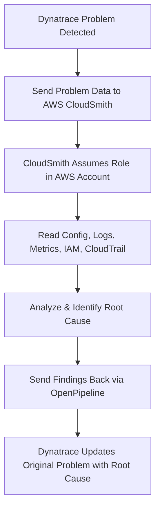
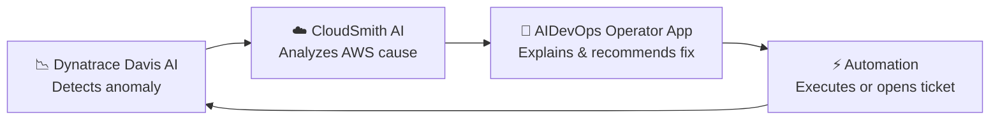
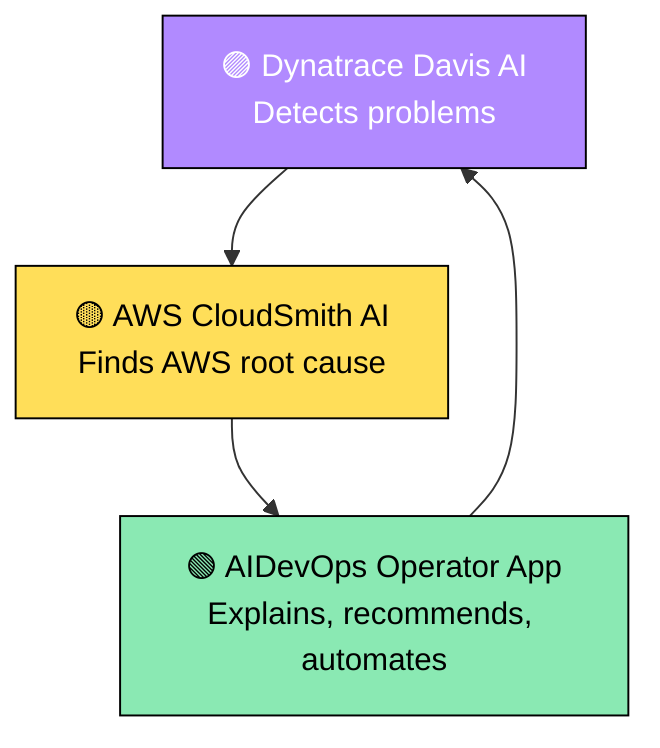

# ☁️ AWS CloudSmith + Dynatrace + AIDevOps – Proof of Concept (POC) Guide

---

### 📘 Combined Overview Document for POC Setup, Architecture, AI Flow, and Security Governance

This document consolidates the four key components for your CloudSmith + Dynatrace + AIDevOps Proof of Concept (POC):

1. 🧩 **AIOpsAssistantPolicy Summary** – AWS IAM visibility and service coverage.  
2. 🚀 **AIDevOps Flow & Use Cases** – Step-by-step operational logic and applied use cases.  
3. 🧠 **AI Providers** – How AWS and Dynatrace AI engines collaborate.  
4. 🔒 **Security & Governance Guide** – Risk, compliance, and enterprise enablement guidelines.  

---


# 📂 AWS CloudSmith AIOpsAssistantPolicy Summary

# 🧠 AWS CloudSmith AIOpsAssistantPolicy – Service Access Overview

This document summarizes the **scope, purpose, and service coverage** of the AWS CloudSmith `AIOpsAssistantPolicy` used within the **AWS AIDevOps beta**.

---

## ⚙️ Overview

The `AIOpsAssistantPolicy` grants **read-only access** across nearly every AWS service to enable **automated investigation, topology mapping, and root-cause correlation** by AWS CloudSmith’s AI engine.

It includes permissions like `Describe*`, `List*`, and `Get*` for visibility—**without modification rights**.

---

## 🔐 Trust and Policy Structure

| Policy Type | Purpose |
|--------------|----------|
| **Trust Policy** | Allows CloudSmith service (`preprod.cloudsmith.amazonaws.com`) to assume a role in your AWS account. |
| **Inline Policy** | Adds targeted read access (e.g., `synthetics:GetCanaryRuns`, `route53:GetHealthCheckStatus`). |
| **Managed Policy** | Core read-only access to ~270–300 AWS services. |
| **Specialized Policies** | Adds read-only access to S3 Amplify assets and API Gateway resources. |

---

## 🧩 Service Coverage by Category

### ☁️ Compute
EC2, Lambda, Elastic Beanstalk, ECS, EKS, Batch, Lightsail, EMR, Outposts, AppRunner

### 🗄️ Storage
S3, S3-Outposts, EFS, FSx, Storage Gateway, Backup, CloudFront, Glacier

### 🌐 Networking & Delivery
VPC, Route53, TransitGateway, Global Accelerator, Cloud Map, NetworkManager, PrivateLink

### 🧮 Databases & Analytics
RDS, DynamoDB, Redshift, Athena, Glue, Lake Formation, Timestream, QLDB, DataSync

### 🔒 Security, Identity & Compliance
IAM, Access Analyzer, KMS, Cognito, GuardDuty, SecurityHub, Inspector, Detective, WAFv2, Shield, Verified Permissions, Macie

### 📈 Monitoring & Observability
CloudWatch, CloudTrail, Logs, X-Ray, DevOps Guru, Application Insights, CloudFormation, Config

### 🤖 Machine Learning & AI
SageMaker, Comprehend, Forecast, FraudDetector, Personalize, Rekognition, LookoutMetrics, LookoutVision, Bedrock

### 🧰 Developer Tools
CodeCommit, CodeBuild, CodeDeploy, CodePipeline, Amplify, AppConfig, CodeGuru, Cloud9

### 🔄 Integration & Serverless
EventBridge, Step Functions, AppFlow, Pipes, AppSync, API Gateway, Proton

### 💬 Messaging & Application Services
SQS, SNS, SES, MQ, Kinesis, EventBridge Scheduler, AppMesh, AppIntegrations

### 💵 Cost & Governance
Budgets, Cost Explorer, Organizations, Config, Service Catalog, Resource Groups, License Manager

### 🧭 Edge, IoT, and Emerging Services
IoT Core, IoT Analytics, IoT Greengrass, DeviceFarm, GroundStation, RoboMaker, Omics, Network Firewall, Verified Permissions, ResilienceHub

### 🧰 Specialized / Support Services
AppRegistry, Workspaces, MediaConvert, MediaLive, MediaConnect, Cloud Directory, Backup Audit Manager, Well-Architected Tool, Systems Manager (SSM)

---

## 📊 Summary

| Category | Estimated Service Count |
|-----------|--------------------------|
| Compute | ~15 |
| Storage | ~10 |
| Networking | ~15 |
| Databases | ~20 |
| Security | ~20 |
| Monitoring | ~10 |
| ML & AI | ~15 |
| Dev Tools | ~10 |
| Serverless & Integration | ~10 |
| Messaging | ~10 |
| Governance | ~10 |
| Specialized / Edge | ~100+ |

🧩 **Total coverage:** ~270–300 AWS services

---

## 🚫 Security Context

- Only `Describe`, `List`, `Get` actions (no write or modify).
- Scoped via `sts:AssumeRole` from CloudSmith to your AgentSpace.
- Access logged via CloudTrail.
- Revocable at any time by removing the IAM role.

---

## 🔁 Operational Flow



---

## 🧠 Key Takeaways

- This policy enables **AI-driven observability** across AWS services.  
- Provides **cross-service correlation** for SRE and DevOps automation.  
- Acts as a **“super SecurityAudit” policy** — broader but still read-only.  
- Powers **AWS CloudSmith + Dynatrace** integration for proactive cloud operations.

---

© 2025 AWS & Dynatrace | For Beta Participants Only


---


# 📂 AWS CloudSmith AIDevOps Flow UseCases

# ☁️ AWS CloudSmith + Dynatrace + AWS AIDevOps  
### 🧭 *AI-driven Cloud Operations — Explained Visually with Real Use Cases*

---

## 🚀 High-Level Flow

```mermaid
flowchart LR
    A[1️⃣ Problem Happens<br/>Lambda fails / 403 / High latency] --> B[2️⃣ Dynatrace Detects & Creates Problem]
    B --> C[3️⃣ Dynatrace Sends Problem Context<br/>to AWS CloudSmith (AIDevOps)]
    C --> D[4️⃣ CloudSmith Assumes IAM Role<br/>in Your AWS Account]
    D --> E[5️⃣ CloudSmith Gathers AWS Facts<br/>IAM, CloudTrail, CFN, CW Metrics]
    E --> F[6️⃣ CloudSmith Runs AI/Logic<br/>to Find Likely Root Cause]
    F --> G[7️⃣ CloudSmith Returns Findings<br/>Back to Dynatrace / Operator App]
    G --> H[8️⃣ (Optional) Trigger Remediation<br/>Workflow / Ticket / Slack]
```

👉 **In short:**  
1️⃣ Dynatrace spots it → 2️⃣ CloudSmith explains it → 3️⃣ AIDevOps orchestrates what to do next 🎯

---

## 🧩 What Each Component Does

### 🟦 Dynatrace
- 🔍 Watches services, Lambdas, APIs, and infrastructure.  
- 🚨 Raises a **Problem** when health degrades.  
- 🧠 Shares **context**: timestamps, entity IDs, error codes, and dependencies.

### 🟧 AWS CloudSmith (The AI Investigator)
- 🧩 Uses the IAM policy you configured (read-only) to look deep into AWS.  
- 📊 Pulls data from:
  - 🧱 **IAM** — who changed what?
  - 🧾 **CloudTrail** — when did it happen?
  - 🧮 **CloudFormation** — was there a deployment?
  - 📈 **CloudWatch** — are metrics spiking?
  - ⚙️ **Service Configs** — Lambda, S3, API Gateway, etc.
- 🤖 Correlates everything → builds a root-cause summary.

**Example Output:**  
> “Lambda is failing because execution role lost `s3:PutObject` at 13:42 UTC.” ✅

### 🟩 AWS AIDevOps / Operator App
- 💬 Used by on-call SREs.  
- 🗂️ Displays CloudSmith’s findings visually.  
- ⚙️ Can open AWS Support, trigger remediation, or run automation scripts.  

---

## 💡 Core Use Cases

### 🟣 **1. IAM Permission Drift**
**Scenario:** Lambda used to write to S3 → IAM role changed → no `s3:PutObject`.  
**Flow:**
1️⃣ Lambda fails → 2️⃣ Dynatrace alerts → 3️⃣ CloudSmith analyzes IAM + CloudTrail  
✅ **Root Cause:** “Execution role missing `s3:PutObject`.”  

🧠 **Value:** No console-hopping for SREs — instant cause visibility.

---

### 🟣 **2. Deployment Impact Analysis**
**Scenario:** Latency spike after deployment.  
**Flow:**
1️⃣ Dynatrace detects latency → 2️⃣ CloudSmith checks CloudFormation + CodePipeline  
✅ **Root Cause:** “Recent deployment to stack `orders-api` correlated with spike.”  

🧠 **Value:** Automatic change correlation — no manual blame tracing.

---

### 🟣 **3. Infrastructure Miswiring**
**Scenario:** API Gateway → Lambda → S3 call fails.  
**Flow:**
1️⃣ Dynatrace flags downstream errors → 2️⃣ CloudSmith inspects VPC + S3 policies  
✅ **Root Cause:** “S3 bucket policy blocking Lambda’s VPC endpoint.”  

🧠 **Value:** Multi-service visibility — identifies misconfigurations instantly.

---

### 🟣 **4. Persistent vs New Issues**
**Scenario:** Same error repeating for weeks.  
**Flow:**
1️⃣ CloudSmith compares baseline vs incident windows.  
✅ **Insight:** “This is a long-standing IAM misconfiguration, not a new event.”  

🧠 **Value:** Focus your team on *new* incidents — skip false alarms.

---

## 🧱 Why That Huge IAM Policy Exists

🔍 CloudSmith needs to “see” across your AWS ecosystem.  
In AWS, every dependency (Lambda, S3, IAM, CloudTrail, etc.) lives in a different service.  
So, AWS gives CloudSmith **broad but read-only** visibility to connect the dots.  

**Security Assurances:**
- 🔒 Only `Describe*`, `List*`, `Get*` actions — *no write or modify*  
- 🪪 Access only via **`sts:AssumeRole`** from CloudSmith service  
- 🧾 Every action logged via **CloudTrail**  
- 🚫 Revocable anytime by deleting or disabling the IAM role  

---

## 🧭 Talking-Point Summary for Slides

> **Detect** 🕵️ in Dynatrace → **Delegate** 🤝 to CloudSmith → **Diagnose** 🧠 via AWS data → **Deliver** ⚡ back to Dynatrace/AIDevOps for action.

---

## 📊 Value at a Glance

| Step | Role | Outcome |
|------|------|----------|
| 1️⃣ | Dynatrace | Detects incident / anomaly |
| 2️⃣ | CloudSmith | Correlates AWS data and finds the cause |
| 3️⃣ | AIDevOps | Automates investigation and workflow |
| 4️⃣ | ServiceNow / Slack | Notifies and/or remediates |
| ✅ | Outcome | Faster MTTR, smarter insights, fewer false positives |

---

## 🧠 Final Takeaways

- 💡 **Detect → Explain → Act → Learn** loop powered by AI.  
- 🔍 CloudSmith = AWS-native AI investigator.  
- 🤝 Dynatrace = Intelligent signal generator.  
- ⚙️ AIDevOps = Automation and workflow brain.  
- 🧩 Combined = Proactive, self-healing cloud operations.

---

© 2025 AWS & Dynatrace | Internal Beta – CloudSmith x AIDevOps


---


# 📂 AWS CloudSmith AI Providers

# 🤖 Who Provides the AI in AWS CloudSmith + Dynatrace + AIDevOps

---

## 🧠 AI Responsibility Matrix

| Layer | Technology | Who Provides the AI | Role of the AI |
|--------|-------------|--------------------|----------------|
| **1️⃣ Dynatrace Davis® AI** | Dynatrace platform | 🟣 **Dynatrace** | Real-time causal AI that *detects* anomalies, patterns, and root-cause chains from metrics, logs, traces, and topology data. |
| **2️⃣ AWS CloudSmith AI Engine** | AWS AIOps (AIDevOps) internal service | 🟡 **Amazon Web Services (AWS)** | Performs *cloud-side reasoning* — cross-service AWS introspection, configuration correlation, and change-impact analysis using AWS’ internal ML models. |
| **3️⃣ AIDevOps Operator App (GenAI layer)** | AWS console & Slack integration | 🟢 **AWS AI/ML foundation models** (Titan, Bedrock, CodeWhisperer-style assistants) | Natural-language summarization, investigation chat, and remediation suggestion generation. |
| **4️⃣ Combined AI Loop** | CloudSmith ↔ Dynatrace ↔ AIDevOps | 🤝 **Joint Intelligence** | Dynatrace’s Davis finds *symptoms*; CloudSmith’s AI finds *causes*; AIDevOps coordinates *actions/remediation*. |

---

## 🧩 In Simple Terms

- **Dynatrace Davis AI** → “What’s broken and where?” 🔍  
- **AWS CloudSmith AI** → “Why did it break in AWS?” 🧠  
- **AIDevOps App AI** → “What should we do about it?” ⚙️  

Together, they form an **AI feedback loop**:



---

## ⚙️ How the AI Works Together

1. **Dynatrace Davis AI** 🟣 detects an anomaly using causal inference.  
2. The incident metadata is sent to **AWS CloudSmith AI** 🟡.  
3. CloudSmith’s models analyze AWS signals (CloudTrail, IAM, Config, CloudFormation).  
4. **AIDevOps Operator App** 🟢 uses **Bedrock-based LLMs** to summarize and recommend fixes.  
5. Optional **automations** remediate or raise a **ServiceNow ticket**.

---

## 🧠 Summary Table

| Function | AI Provider | Description |
|-----------|--------------|--------------|
| **Detection** | Dynatrace (Davis® AI) | Observability & causal detection across metrics/logs/traces |
| **Diagnosis** | AWS (CloudSmith AI Engine) | AWS account–level correlation and root-cause graphing |
| **Narration & Action** | AWS (AIDevOps Operator App, Bedrock) | Natural-language reasoning, workflow triggers |
| **End-to-End Outcome** | Joint Dynatrace + AWS | Closed-loop, AI-driven incident response |

---

## 🧩 Key Insight

> 🧠 The AI is **jointly powered** — Dynatrace supplies the **observability intelligence**, and AWS supplies the **cloud reasoning and automation intelligence** through **CloudSmith** and **AIDevOps**.

---

## 🖼️ Conceptual Visualization



---

## ⚡ Bottom Line

- 🟣 **Dynatrace** → Observability & causal AI.  
- 🟡 **CloudSmith (AWS)** → Root-cause AI using AWS internal telemetry.  
- 🟢 **AIDevOps (AWS)** → GenAI-driven investigation & remediation layer.  
- 🤝 **Together** → Closed-loop intelligence: *Detect → Explain → Act → Learn.*

---

© 2025 AWS & Dynatrace | Internal Beta – CloudSmith x AIDevOps  


---


# 📂 AWS CloudSmith Security Governance Guide v2

# 🔒 AWS CloudSmith Read Access & Enterprise Governance Guide

---

## 🧱 1. What’s Really Happening

When you create the **AIDevOps AgentSpace IAM role**, it grants CloudSmith `Describe*`, `List*`, and `Get*` access across **hundreds of AWS services**.  
This gives CloudSmith near-complete **read-only observability** over your environment:

- Query all resources and relationships (EC2, S3, IAM, CloudFormation, etc.)  
- Pull CloudWatch metrics, Config snapshots, and CloudTrail events  
- Enumerate stacks, roles, policies, and dependencies  

💡 It’s like combining **SecurityAudit + Config + CloudTrail + DevOpsGuru + Detective + X-Ray** — all in read-only mode.

---

## 🧩 2. Why AWS Designed It This Way

To let CloudSmith’s AI **correlate cross-service data**, it must read:

| Data Source | Purpose |
|--------------|----------|
| 🧾 CloudTrail / Config | Detect configuration or permission changes |
| 📈 CloudWatch / Logs | Identify service failures and metric anomalies |
| ⚙️ IAM / VPC / CFN | Reconstruct topology and dependencies |
| 🚀 CodePipeline / CFN | Detect deployments that preceded incidents |

Without this, CloudSmith’s AI can’t reason across AWS service boundaries.

---

## 🔐 3. Security Guardrails from AWS

| Control | Purpose |
|----------|----------|
| ✅ **Read-only actions only** | No writes; strictly `Describe/List/Get`. |
| 🪪 **Scoped trust policy** | Only AWS’ own service principal can assume the role. |
| 🧩 **Per-account opt-in** | Manual enablement; not automatic organization-wide. |
| 📜 **CloudTrail visibility** | All access logged for review. |
| ⛔ **Revocable anytime** | Disable or delete the IAM role instantly. |
| 🧠 **Planned refinement** | AWS plans to reduce scope into domain bundles at GA. |

---

## ⚠️ 4. Enterprise Considerations

Before rollout:

1. 🧾 Perform **internal security review** (treat as external auditor-level visibility).  
2. 🛡️ Use **SCPs** to block CloudSmith from seeing sensitive services (PII, HR data, etc.).  
3. 🕵️ Monitor CloudTrail for CloudSmith activity.  
4. 🔐 Start in **sandbox or non-prod** accounts first.  
5. 🏷️ Tag resources `allow-cloudsmith:true` (future filter control).

---

## 💬 5. Framing for Leadership

> CloudSmith access = a *read-only automated auditor* view into AWS.  
> It’s safe, logged, and revocable — but requires governance, like AWS Config or GuardDuty.

---

## ✅ 6. Practical Governance Rollout Plan

| Step | Action | Responsible Team |
|------|---------|------------------|
| 1️⃣ | Enable CloudSmith in pilot accounts | CloudOps / Observability |
| 2️⃣ | Review CloudTrail access logs | Security / SOC |
| 3️⃣ | Record IAM policy exceptions | Risk / Compliance |
| 4️⃣ | Expand under governance approval | Cloud Governance Board |
| 5️⃣ | Add automated SCP enforcement | Cloud Security Engineering |

---

## 🧩 Summary

- 🔍 CloudSmith requires **broad read-only visibility**.  
- 🧠 AWS adds **guardrails** (trust, opt-in, CloudTrail).  
- 🏗️ Treat as a **high-trust observability integration** under enterprise review.  
- 🚦 **Start small, monitor, and scale with compliance alignment.**

---

© 2025 AWS & Dynatrace | *Internal Beta – CloudSmith x AIDevOps Security Overview*


---

